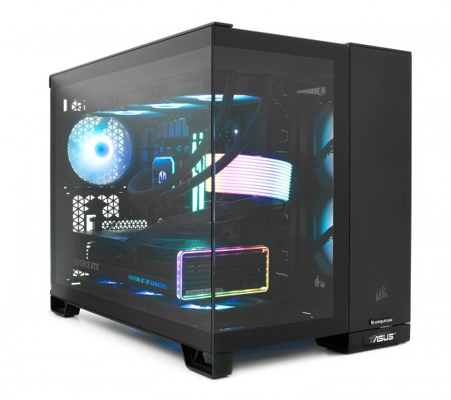

<html lang="pl">
<head>
  <meta charset="utf-8">
  <title>Komponenty komputerowe</title>
  <meta name="description" content="Serwis prezentuje komponenty komputerowe. Sprawdź, czy znasz je wszystkie">
  <meta name="keywords" content="komputery, procesory, karty graficzne, GPU, CPU, płyta główna, ziemniak">
  <meta http-equiv="X-UA-Compatible" content="IE=edge,chrome=1">
  
</head>
<body>
  

    

      <h1>Komponenty komputerowe</h1>
    

    

      Komponenty Komputerowe:
        
      <a href="https://michu-sys.github.io/komp1/">- Procesor</a>  
      <a href="https://michu-sys.github.io/komp3/">- Płyta Główna</a>  
      <a href="https://michu-sys.github.io/komp4/">- Karta Graficzna</a>  
      <a href="https://michu-sys.github.io/komp2/">- Pamięć Ram</a>  
      <a href="https://michu-sys.github.io/komp5/">- Zasilacz</a>  
      <a href="https://michu-sys.github.io/komp6/">- Chłodzenie</a>  
      <a href="https://michu-sys.github.io/komp7/">- Dysk HDD/SSD</a> 
    

    

      <h2>Komponenty komputerowe – podstawy działania komputera</h2>
      

        Komputer to złożone urządzenie, które składa się z wielu współpracujących ze sobą komponentów. Do najważniejszych z nich należy procesor (CPU), który pełni rolę "mózgu" komputera, wykonując obliczenia i zarządzając działaniem systemu. Pamięć RAM umożliwia szybki dostęp do danych potrzebnych w danej chwili, a dysk twardy (HDD lub SSD) służy do trwałego przechowywania informacji. Płyta główna łączy wszystkie elementy i umożliwia ich komunikację. Karta graficzna (GPU) odpowiada za przetwarzanie grafiki, co jest kluczowe w grach i programach graficznych. Zasilacz dostarcza energii do wszystkich podzespołów, a obudowa chroni je i zapewnia odpowiednią wentylację. Wszystkie te elementy wspólnie tworzą sprawnie działający system.
      

       
      <a href="https://www.komputronik.pl/category/5805/czesci-pc.html"> Najlepsze części do komputera </a>  
      

      

        
      
  
    

    

      
    

 
   
    

      Komponenty komputerowe - Michu 3301 &copy; Wszelkie prawa zastrzeżone
    

  

</body>
</html>
